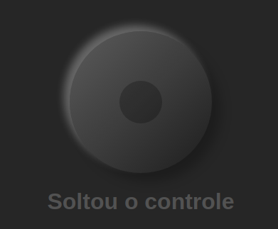
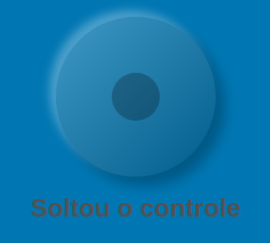
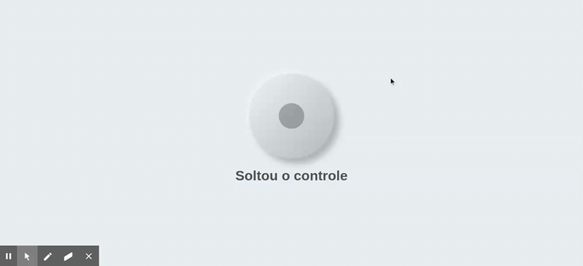
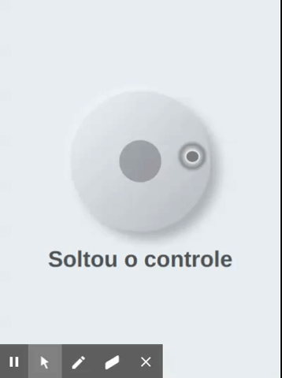
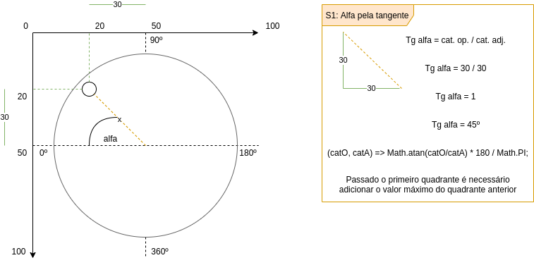

# ANALOG-CONTROLLER

Controle analógico feito em angular, que interage com eventos do mouse e de toque, layout com base no neomorfismo, a cor se adapta à cor de fundo do layout em que é implantado, o tamanho pode ser definido por parâmetro. A resposta é um angulo de 0º a 360º, com base no lado esquerdo e indo em sentido horário.

## Instalação

Instalavel via npm em aplicações angular, ele é uma div que que se adapta a um elemento pai. Para instalar:
```
npm i angalog-controller
```

E colocar ele no módulo da sua aplicação:
```
import { AnalogControllerModule } from 'angalog-controller/src/app/analog-controller/analog-controller.module';
    ...
    imports: [
        ...
        AnalogControllerModule,
        ...
    ],
    ...
```

- Tamanho

O tamanho default é _200px_, mas ele pode ser alterado atavés da propriedade ```controllerSize```.

- Ângulo

É acessado através do ```[(ngModel)]```, tendo um valor numérico e _null_ para que ele volte à posição inicial. A escala de ângulos vai de 1 a 360, o que for maior ou menor que isso será convertido ao número válido mais próximo.

## Layout Adaptável

- Dark



- Azul



- Verde


## Funcionamento

- Web



- Mobile



## Lógica

Os ângulos começam a contar do lado esquerdo, com base no ponto atual do analógico em relação ao centro do controle, é calculado o angulo da tangente naquele quadrante e incrementado um valor que varia de acordo com o quadrante, para que então seja encontrado o ângulo relativo.

